# Keywords

**What it is**
A **keyword** is a word that JavaScript has *reserved for itself*. You **cannot** use a keyword as a variable, function, or class name — the language already uses it to mean something specific (like `if`, `return`, `class`).

---

## Master Table — Every JavaScript Keyword

| Keyword | Category | What it does | Quick Example |
|---|---|---|---|
| `await` | Async | Pauses inside an `async` function until a Promise settles | `await fetch(url)` |
| `break` | Control flow | Exits a loop or `switch` early | `break;` |
| `case` | Control flow | A branch label inside `switch` | `case 1:` |
| `catch` | Error handling | Handles an error thrown in `try` | `catch (e) {}` |
| `class` | Class / OOP | Declares a class | `class User {}` |
| `const` | Declaration | Block-scoped constant (cannot be reassigned) | `const PI = 3.14;` |
| `continue` | Control flow | Skips to the next loop iteration | `continue;` |
| `debugger` | Debugging | Pauses execution if devtools are open | `debugger;` |
| `default` | Control flow | Fallback branch in `switch`; also default export | `default:` |
| `delete` | Operator | Removes a property from an object | `delete obj.x;` |
| `do` | Loop | Runs a loop body at least once | `do {} while (x);` |
| `else` | Control flow | The "otherwise" branch of `if` | `else {}` |
| `enum` | Reserved (future) | Reserved for future use — **never usable** | ❌ not usable |
| `export` | Module | Makes values available to other modules | `export const x = 1;` |
| `extends` | Class / OOP | Inherits from a parent class | `class A extends B {}` |
| `false` | Literal | The boolean false value | `let ok = false;` |
| `finally` | Error handling | Always runs after `try` / `catch` | `finally {}` |
| `for` | Loop | Repeats code a set number of times | `for (let i=0;i<3;i++)` |
| `function` | Function | Declares a function | `function go() {}` |
| `if` | Control flow | Runs code only when a condition is true | `if (x > 0) {}` |
| `implements` | Reserved (strict) | Reserved in strict mode | ❌ not usable |
| `import` | Module | Brings values in from another module | `import x from "m";` |
| `in` | Operator / Loop | Property check; or iterate object keys | `"a" in obj` / `for (k in o)` |
| `instanceof` | Operator | Tests if an object is of a given class | `x instanceof Date` |
| `interface` | Reserved (strict) | Reserved in strict mode | ❌ not usable |
| `let` | Declaration | Block-scoped variable | `let x = 1;` |
| `new` | Operator | Creates an instance of a constructor | `new Date()` |
| `null` | Literal | Intentional "no value" | `let x = null;` |
| `package` | Reserved (strict) | Reserved in strict mode | ❌ not usable |
| `private` | Reserved (strict) | Reserved in strict mode | ❌ not usable |
| `protected` | Reserved (strict) | Reserved in strict mode | ❌ not usable |
| `public` | Reserved (strict) | Reserved in strict mode | ❌ not usable |
| `return` | Function | Sends a value back from a function | `return x;` |
| `static` | Class / OOP | Defines a method on the class, not instances | `static create() {}` |
| `super` | Class / OOP | Refers to the parent class | `super();` |
| `switch` | Control flow | Picks one of many branches | `switch (x) {}` |
| `this` | Object | Refers to the current object context | `this.name` |
| `throw` | Error handling | Raises an error manually | `throw new Error("!");` |
| `true` | Literal | The boolean true value | `let ok = true;` |
| `try` | Error handling | Wraps code that might fail | `try {}` |
| `typeof` | Operator | Returns a string of the value's type | `typeof 5 // "number"` |
| `var` | Declaration | Function-scoped variable | `var x = 1;` |
| `void` | Operator | Evaluates an expression and returns `undefined` | `void 0` |
| `while` | Loop | Repeats while a condition is true | `while (x < 5) {}` |
| `with` | Control flow | Extends scope chain (*forbidden in strict mode*) | ⚠️ avoid |
| `yield` | Generator | Pauses/resumes a generator function | `yield 1;` |

> **Note:** `let`, `static`, `await`, and `async` were once "future reserved" words — they are now **real, standard keywords**.

---

## Category Breakdown Tables

### 1. Variable Declaration

| Keyword | Scope | Reassign? | Redeclare? | Hoisted? |
|---|---|---|---|---|
| `var` | Function | ✅ Yes | ✅ Yes | ✅ as `undefined` |
| `let` | Block `{ }` | ✅ Yes | ❌ No | ⚠️ TDZ (unusable before line) |
| `const` | Block `{ }` | ❌ No | ❌ No | ⚠️ TDZ, must be initialized |

### 2. Control Flow

| Keyword | Purpose | Works with |
|---|---|---|
| `if` / `else` | Branch on a condition | Booleans / truthy values |
| `switch` / `case` / `default` | Multi-way branch | `break` |
| `break` | Exit loop or switch | `for`, `while`, `switch` |
| `continue` | Skip to next iteration | `for`, `while` |

### 3. Loops

| Keyword | Best for | Notes |
|---|---|---|
| `for` | Known number of repeats | `for (init; test; update)` |
| `while` | Unknown repeats, check first | May run 0 times |
| `do` | Must run at least once | Check happens *after* body |
| `for...in` | Object **keys** | Avoid for arrays |
| `for...of` | Iterable **values** | Arrays, strings, Maps, Sets |

### 4. Functions

| Keyword | Purpose |
|---|---|
| `function` | Declares a reusable block of code |
| `return` | Sends a value back and stops the function |
| `async` | Marks a function that returns a Promise |
| `await` | Waits for a Promise *inside* an `async` function |
| `yield` | Produces a value from a generator function |

### 5. Classes & OOP

| Keyword | Purpose |
|---|---|
| `class` | Declares a class |
| `extends` | Inherits from a parent class |
| `super` | Calls the parent class constructor/methods |
| `this` | Refers to the current instance |
| `static` | Belongs to the class itself, not instances |
| `new` | Creates an instance |
| `instanceof` | Checks the class of an object |

### 6. Modules

| Keyword | Direction | Purpose |
|---|---|---|
| `export` | Out 📤 | Shares values with other files |
| `import` | In 📥 | Brings values from other files |

### 7. Error Handling

| Keyword | Purpose |
|---|---|
| `try` | Wraps risky code |
| `catch` | Handles the thrown error |
| `finally` | Runs no matter what |
| `throw` | Raises an error manually |
| `debugger` | Pauses for debugging |

### 8. Operators / Expressions

| Keyword | What it returns | Example |
|---|---|---|
| `typeof` | Type as a string | `typeof "a"` → `"string"` |
| `instanceof` | Boolean | `[] instanceof Array` → `true` |
| `in` | Boolean | `"id" in user` |
| `delete` | Boolean | `delete obj.x` |
| `new` | New object | `new Map()` |
| `void` | Always `undefined` | `void 0` |

### 9. Literals & Special Values

| Keyword | Meaning |
|---|---|
| `true` | Boolean true |
| `false` | Boolean false |
| `null` | Intentional emptiness (set by you) |
| `undefined` | Not assigned (set by JS) — *technically a global value, not a keyword* |
| `this` | Current context object |
| `super` | Parent class reference |

### 10. Reserved Words (You Cannot Use These)

| Keyword | Status | Notes |
|---|---|---|
| `enum` | Always reserved | Reserved for possible future use |
| `implements` | Reserved in strict mode | Only blocked in `"use strict"` |
| `interface` | Reserved in strict mode | Only blocked in strict mode |
| `package` | Reserved in strict mode | Only blocked in strict mode |
| `private` | Reserved in strict mode | Reserved for future class fields |
| `protected` | Reserved in strict mode | Reserved for future use |
| `public` | Reserved in strict mode | Reserved for future use |
| `with` | Forbidden in strict mode | Legal otherwise, but avoid it |

### 11. Contextual Keywords (Only keywords in certain places)

| Word | Acts as keyword when… | Otherwise |
|---|---|---|
| `async` | Before a function | Valid identifier name |
| `await` | Inside `async` / top-level modules | Valid identifier name |
| `as` | In `import`/`export` aliasing | Valid identifier name |
| `from` | In `import ... from` | Valid identifier name |
| `of` | In `for...of` | Valid identifier name |
| `get` / `set` | Defining getters/setters | Valid method names |
| `static` | Inside a class | Valid identifier name |

---

## Example Walkthrough

```js
// 1. KEYWORDS declare things
class User {                       // class
  static count = 0;                // static
  constructor(name) {              // (constructor is NOT a keyword)
    this.name = name;              // this
    User.count++;                  // uses class name
  }
}

// 2. KEYWORDS check conditions
const age = 20;                    // const
if (age >= 18) {                   // if
  console.log("adult");            // (console is NOT a keyword)
} else {                           // else
  console.log("minor");
}

// 3. KEYWORDS repeat code
for (let i = 0; i < 3; i++) {      // for + let
  if (i === 1) continue;           // continue
  console.log(i);                  // 0, 2
}

// 4. KEYWORDS handle errors
try {                              // try
  throw new Error("boom");         // throw + new
} catch (e) {                      // catch
  console.log(e.message);          // boom
} finally {                        // finally
  console.log("done");             // done
}
```

### ❌ What happens if you use a keyword as a name

```js
let class = 5;      // SyntaxError: Unexpected token 'class'
let if = true;      // SyntaxError: Unexpected token 'if'
let for = 1;        // SyntaxError: Unexpected token 'for'
```

```js
let className = 5;  // ✅ fine — just add a letter
let isIf = true;    // ✅ fine — keyword is only a keyword alone
```

---

## How Keywords Fit Together

```mermaid
flowchart TD
    K["🔑 JavaScript Keywords"] --> A["📦 Declare<br/>var let const function class"]
    K --> B["🔀 Control Flow<br/>if else switch case default"]
    K --> C["🔁 Loops<br/>for while do break continue"]
    K --> D["⚙️ Functions<br/>return async await yield"]
    K --> E["🏛️ OOP<br/>new this super extends static instanceof"]
    K --> F["📥📤 Modules<br/>import export"]
    K --> G["🛟 Errors<br/>try catch finally throw"]
    K --> H["🧮 Operators<br/>typeof in delete void"]
    K --> I["🔒 Reserved<br/>enum implements interface private"]

    style K fill:#e3f2fd,stroke:#1976d2,stroke-width:2px
    style A fill:#e8f5e9,stroke:#388e3c
    style B fill:#fff3e0,stroke:#f57c00
    style C fill:#fce4ec,stroke:#c2185b
    style D fill:#f3e5f5,stroke:#7b1fa2
    style E fill:#e0f7fa,stroke:#00838f
    style F fill:#fffde7,stroke:#f9a825
    style G fill:#ffebee,stroke:#d32f2f
    style H fill:#ede7f6,stroke:#5e35b1
    style I fill:#eeeeee,stroke:#616161
```



---

## TL;DR

| Group | Keywords | Count |
|---|---|---|
| Declaration | `var` `let` `const` `function` `class` | 5 |
| Control flow | `if` `else` `switch` `case` `default` `break` `continue` | 7 |
| Loops | `for` `while` `do` `in` `of` | 5 |
| Functions / async | `return` `async` `await` `yield` | 4 |
| Classes / OOP | `new` `this` `super` `extends` `static` `instanceof` | 6 |
| Modules | `import` `export` | 2 |
| Errors | `try` `catch` `finally` `throw` `debugger` | 5 |
| Operators | `typeof` `in` `delete` `void` | 4 |
| Literals | `true` `false` `null` `this` `super` | 5 |
| Reserved | `enum` `implements` `interface` `package` `private` `protected` `public` `with` | 8 |

**One-line mental model:** Keywords are the **fixed vocabulary of JavaScript** — you *use* them to tell the language what to do, but you can **never name anything after them**.

---

## Gotchas / Notes

- **Keywords cannot be identifiers.** `let class = 1;` → `SyntaxError`. Add a letter (`className`) to fix it.
- **`undefined`, `NaN`, `Infinity`** are *global properties*, **not** keywords — but you should still never use them as names.
- **`console`, `document`, `window`, `Math`** are objects, **not keywords** — the language provides them, but they're plain values.
- **Contextual keywords** (`async`, `from`, `of`, `as`, `get`, `set`) are only special in certain positions — `let from = 1;` is actually legal.
- **`with` is a keyword but banned in strict mode** — it's legacy and shouldn't be used.
- **Strict mode matters:** `implements`, `interface`, `package`, `private`, `protected`, `public` are only blocked inside `"use strict"` code.
- **`enum` is always reserved** in every mode — it can never be a variable name.
- **Capitalization counts:** `this` is a keyword, but `This` and `THis` are just ordinary names.
