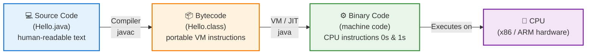

# Source Code vs Bytecode vs Binary Code

**What it is**
They are the **three stages of a program's life**: source code is what *humans* write, bytecode is a *middle, portable* form, and binary code is what the *CPU actually runs*.

---

## Breakdown Table

| Aspect | **Source Code** | **Bytecode** | **Binary Code (Machine Code)** |
|---|---|---|---|
| **Written by** | Humans (developers) | Compiler / transpiler | Compiler / assembler / JIT |
| **Read by** | Humans | A Virtual Machine (VM) | The CPU directly |
| **Portability** | Highly portable (text file) | Portable across platforms (needs a VM) | Tied to one CPU architecture |
| **Format** | Plain text (`.java`, `.js`, `.c`, `.py`) | Binary *instructions* for a VM | Raw `0`s and `1`s (machine instructions) |
| **Examples** | `console.log("hi")` | Java `.class`, `.pyc`, JS bytecode | x86-64, ARM64 executables (`.exe`, ELF) |
| **Human readable?** | ✅ Yes | ⚠️ Only with a disassembler | ❌ No |
| **Speed** | N/A (not executed directly) | Medium (VM interprets/JITs it) | Fastest (runs natively on hardware) |
| **Produced by** | Developer's editor | `javac`, `tsc`, CPython, V8 | Linker / AOT compiler / JIT |

---

## Example Walkthrough

Take this tiny program that adds two numbers:

```java
// Hello.java  — THIS IS SOURCE CODE
public class Hello {
    public static void main(String[] args) {
        int a = 5;
        int b = 3;
        System.out.println(a + b);
    }
}
```

### Step 1 — Source Code
You write the code above by hand. It's readable English-like text stored in a `.java` file. The computer **cannot run it yet** — it must be translated.

### Step 2 — Bytecode
You run `javac Hello.java`. The compiler turns the source into **`Hello.class`** containing *bytecode*. Inside it, instructions look like:

```
iload_1        // push variable a
iload_2        // push variable b
iadd           // add them
invokevirtual  // call println
```

- This is **not text** — it's a compact binary set of instructions.
- It is **not tied to one CPU**. Any device with a Java Virtual Machine (JVM) can run it. *"Write once, run anywhere."*

### Step 3 — Binary Code (Machine Code)
When you run `java Hello`, the **JVM (or a JIT compiler)** converts that bytecode into the actual machine instructions your CPU understands — e.g. x86-64 or ARM64 opcodes:

```
10111000 00000101 00000000 00000000 ...   // mov eax, 5
00000001 11011000 ...                     // add eax, ebx
```

- These are raw `0`s and `1`s.
- They are **specific to your CPU architecture**. Code built for ARM won't run on x86.
- This is the **only** form the hardware can execute.

> **Note:** Not every language uses all three stages. C/C++ often go **straight from source → binary** (skipping bytecode). Python produces bytecode (`.pyc`) then interprets it. JavaScript engines use a JIT that goes source → bytecode → machine code on the fly.

---

## Pipeline Diagram



**One-line mental model:** Source = *recipe in English* → Bytecode = *recipe in shorthand* → Binary = *the actual cooking movements*.

---

## TL;DR

| Layer | Analogy | Who understands it |
|---|---|---|
| **Source Code** | Recipe written in English | Humans |
| **Bytecode** | Recipe in a universal shorthand | A Virtual Machine |
| **Binary Code** | The physical hand movements cooking | The CPU |

- **Source code** = human-friendly instructions you write.
- **Bytecode** = portable, halfway-compiled instructions for a VM.
- **Binary code** = the final `0`s and `1`s the CPU runs natively.

All three are just **the same logic expressed at different levels of translation** — from human language down to the hardware's native tongue.

---

## Gotchas / Notes

- **"Binary" ≠ just "a file with `0`s and `1`s."** All files are binary at disk level. *Binary code* specifically means **machine instructions** for the CPU.
- **Bytecode is still binary data**, but it targets a *virtual* machine, not real hardware.
- **Compiled vs interpreted** is a spectrum: many modern runtimes (JVM, V8, .NET) use both a VM **and** a JIT to reach native machine code at runtime.
- **Architecture matters for binary: code built for one CPU family will not run on another** (that's why cross-platform apps ship separate builds).
