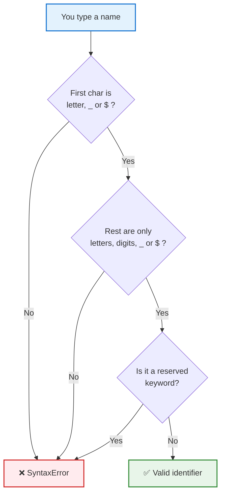

# Identifier Rules in JavaScript

**What it is**
An **identifier** is the name you give to a variable, function, class, parameter, or object property. JavaScript has strict rules about what those names may and may not contain — break a rule and you get a `SyntaxError` before any code runs.

---

## 1. Core Rules — Allowed vs Not Allowed

| # | Rule | Allowed? | Valid Example | Invalid Example | Error if broken |
|---|---|---|---|---|---|
| 1 | Must start with a **letter** (a–z, A–Z) | ✅ YES | `name`, `X` | — | — |
| 2 | May start with **`_`** (underscore) | ✅ YES | `_temp`, `_private` | — | — |
| 3 | May start with **`$`** (dollar) | ✅ YES | `$price`, `$el` | — | — |
| 4 | Must **NOT** start with a **digit** | ❌ NO | `item2` | `2ndItem` | `SyntaxError: Invalid or unexpected token` |
| 5 | May **contain digits** after the first character | ✅ YES | `user1`, `x2y3` | — | — |
| 6 | Must **NOT** contain **spaces** | ❌ NO | `firstName` | `first name` | `SyntaxError: Unexpected identifier` |
| 7 | Must **NOT** contain **hyphens `-`** | ❌ NO | `firstName` | `first-name` | `SyntaxError` (read as subtraction) |
| 8 | Must **NOT** contain **dots `.`** | ❌ NO | `userName` | `user.name` | read as property access |
| 9 | Must **NOT** contain **special symbols** `@ # % ! & *` | ❌ NO | `priceValue` | `price#`, `a@b` | `SyntaxError` |
| 10 | Must **NOT** be a **reserved keyword** | ❌ NO | `value` | `let`, `class`, `for`, `if` | `SyntaxError: Unexpected token` |
| 11 | **Case-sensitive** — case matters | ✅ YES | `age` and `Age` are **two different** variables | treating them as one | logic bug, not an error |
| 12 | Must **NOT** be empty | ❌ NO | `x` | `let = 5;` | `SyntaxError` |
| 13 | Can be **Unicode** letters (e.g. Hindi, Greek) | ✅ YES | `नाम`, `π` | — | — |
| 14 | Must **NOT** use strict-mode reserved words | ❌ NO | `pkg` | `package`, `private`, `public`, `interface` | `SyntaxError` in `"use strict"` |

> **Golden rule:** an identifier must start with a **letter, `_`, or `$`**, and after that it may only contain **letters, digits, `_`, or `$`**.

---

## 2. Valid Name Character Chart

| Character type | Can be **first** char? | Can be **later** char? | Example |
|---|---|---|---|
| Letter `a–z` / `A–Z` | ✅ Yes | ✅ Yes | `userName` |
| Underscore `_` | ✅ Yes | ✅ Yes | `_count`, `my_var` |
| Dollar `$` | ✅ Yes | ✅ Yes | `$`, `a$b` |
| Digit `0–9` | ❌ No | ✅ Yes | `item2` (not `2item`) |
| Space | ❌ No | ❌ No | `first name` ❌ |
| Hyphen `-` | ❌ No | ❌ No | `first-name` ❌ |
| Dot `.` | ❌ No | ❌ No | `user.name` ❌ |
| `@ # % ! & *` | ❌ No | ❌ No | `price#` ❌ |

---

## 3. Allowed Symbols (Regex View)

| Test | Regex | Meaning |
|---|---|---|
| Starts correctly | `/^[A-Za-z_$]/` | first char must be letter, `_`, or `$` |
| Rest of name | `/[A-Za-z0-9_$]*$/` | only letters, digits, `_`, `$` |
| Full valid identifier | `/^[A-Za-z_$][A-Za-z0-9_$]*$/` | a complete valid name |

---

## 4. Naming Styles (Conventions, not rules)

| Style | Looks like | Used for | Valid in JS? |
|---|---|---|---|
| camelCase | `firstName` | variables & functions ✅ | ✅ |
| PascalCase | `FirstName` | classes & constructors ✅ | ✅ |
| snake_case | `first_name` | Python-style (rare in JS) | ✅ |
| SCREAMING_SNAKE | `MAX_SIZE` | true constants ✅ | ✅ |
| kebab-case | `first-name` | ❌ cannot be used | ❌ ILLEGAL |

> These are **conventions**, not language rules. `first_name` is legal JS; `first-name` is not.

---

## 5. Good vs Bad Identifiers

| ❌ Bad | Why it fails | ✅ Good |
|---|---|---|
| `2ndUser` | starts with a digit | `secondUser` |
| `first name` | contains a space | `firstName` |
| `first-name` | contains a hyphen | `firstName` |
| `user.name` | contains a dot | `userName` |
| `let` | reserved keyword | `letValue` |
| `class` | reserved keyword | `className` |
| `price#` | special symbol | `price` |
| `a` | valid but meaningless | `age` |
| `MyVar` | inconsistent casing | `myVar` |
| `data` | too generic | `products` |

---

## 6. Reserved Words You Cannot Use as Identifiers

| Category | Reserved words | Note |
|---|---|---|
| Declarations | `var` `let` `const` `function` `class` | Always reserved |
| Control flow | `if` `else` `switch` `case` `default` `break` `continue` | Always reserved |
| Loops | `for` `while` `do` `in` `of` | Always reserved |
| Functions / async | `return` `async` `await` `yield` | Always reserved |
| OOP | `new` `this` `super` `extends` `static` `instanceof` | Always reserved |
| Errors | `try` `catch` `finally` `throw` `debugger` | Always reserved |
| Literals | `true` `false` `null` | Always reserved |
| Modules | `import` `export` | Always reserved |
| Operators | `typeof` `delete` `void` | Always reserved |
| Always-reserved word | `enum` | Reserved in every mode |
| Strict-mode only | `implements` `interface` `package` `private` `protected` `public` | Blocked in `"use strict"` |

---

## 7. Code Examples

```js
// ✅ VALID identifiers
let name = "Ravi";        // starts with a letter
let _count = 5;           // starts with underscore
let $price = 99.99;       // starts with dollar
let item2 = "ok";         // digit not first
let camelCase = true;     // camelCase convention
let PascalCase = {};      // PascalCase convention
let firstName_1 = "A";    // mix of valid characters
```

```js
// ❌ INVALID identifiers — each throws SyntaxError
let 2ndUser = 30;         // starts with a digit
let first name = "A";     // contains a space
let first-name = "A";     // contains a hyphen
let user.name = "A";      // contains a dot
let let = 5;              // reserved keyword
let price# = 10;          // special symbol
```

```js
// ⚠️ VALID but CONFUSING
let age = 25;             // two different variables...
let Age = 30;             // ...because JS is case-sensitive
console.log(age, Age);    // 25 30
```

---

## 8. How to Check an Identifier



---

## 9. TL;DR

| Question | Answer |
|---|---|
| What can an identifier start with? | A letter, `_`, or `$` |
| What can it contain after that? | Letters, digits, `_`, `$` |
| Can it start with a number? | No |
| Can it contain spaces or hyphens? | No |
| Can it be a keyword like `let` or `class`? | No |
| Is JS case-sensitive? | Yes (`age` ≠ `Age`) |
| Are `_` and `$` legal? | Yes, even alone |
| What convention should I use? | camelCase, descriptive names |

**One-line mental model:** *Start with a letter, `_`, or `$` — then only letters, digits, `_`, or `$` — and never borrow a word JavaScript already owns.*

---

## Gotchas / Notes

- **Hyphens are the most common mistake.** `first-name` *looks* fine but JS reads the `-` as subtraction → `SyntaxError`. Use camelCase instead.
- **`age` and `Age` are different variables.** Typos in casing create silent logic bugs rather than errors.
- **Reserved keywords fail only as identifiers.** `let letValue = 5;` is fine; `let let = 5;` is not.
- **`implements`, `interface`, `package`, `private`, `protected`, `public`** are only blocked inside `"use strict"` code — but avoid them anyway.
- **`enum` is reserved in every mode** and can never be a name.
- **`undefined`, `NaN`, `Infinity`** are not keywords, but assigning to them is a bad idea.
- **`_` and `$` alone are valid identifiers** — legal, but useless unless you know what they mean.
- **Unicode letters are allowed** (`π`, `नाम`), but mixing scripts in one project hurts readability.
